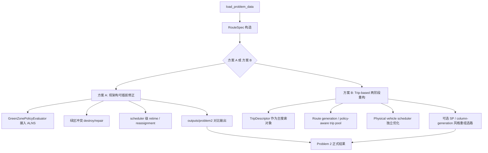

# 基于题面与仓库代码审计的第2问改进研究报告

## Executive Summary

我已按要求先通过启用的 GitHub 连接器访问并读取仓库 `Xiong-z-x/Math_Modeling_Project`，随后复核了你上传的原题 PDF 与补充说明，并逐项审计了根目录文档、项目内核心 Markdown、`problem2` 相关代码、测试与现有输出。审计结论很明确：当前仓库已经把**第一问的“数据层—评价器—ALNS—物理车辆排班—诊断输出”链路做完整了**，但**第二问仍停留在“政策接口 + 冲突预判 + 容量诊断”阶段**，尚未落地为真正的 `problems/problem2.py` 求解器。题面层面最关键的事实有三点：绿色区应按坐标重新判定，补充说明校正了速度分布，且 **17:00 之后速度未指定**；仓库目前采用“17:00 后沿用一般时段”的工程假设，这个假设必须在论文和实验中显式声明。结合仓库现状与外部文献，我建议优先实施一条**低改动、可插拔**的 Problem 2 修正线：在现有 `RouteSpec -> scheduler -> Solution` 架构上加入**可行性优先的政策约束与绿区专用算子**；如果目标是进一步提升解质量与可解释性，再进入**trip-based 两阶段重构**。fileciteturn58file0turn59file0turn60file0turn61file0turn62file0turn57file0turn49file0turn48file0

## 审计范围与已读取材料

本次审计使用到的启用连接器只有 **GitHub**；仓库已可正常读取。除连接器外，我还复核了你上传到会话中的原题 PDF《A题：城市绿色物流配送调度.pdf》与《补充说明》，并将其与仓库中的 `findings.md`、`解题总思路.md`、数据层 README 交叉核对。仓库入口文档显示，项目当前已形成“根目录主文档 + `green_logistics/` 求解器包 + `tests/` + `problems/` + `outputs/` + 参考资料”的稳定结构，且明确把 `outputs/problem1/` 标为正式第一问结果。fileciteturn58file0turn59file0turn60file0turn61file0turn64file0

本次实际读取并用于判断的材料如下。

| 类别 | 已读取文件 | 作用 |
| --- | --- | --- |
| 题面与补充 | 本地上传 PDF《A题：城市绿色物流配送调度.pdf》《关于第十八届“华中杯”大学生数学建模挑战赛A题的补充说明.pdf》；仓库 `findings.md`、`解题总思路.md` | 还原正式约束口径，并校正仓库假设边界 |
| 根目录主文档 | `README.md`、`findings.md`、`task_plan.md`、`progress.md`、`项目文件导航.md`、`解题总思路.md` | 确认技术路线、项目阶段、已完成模块与下一步计划 |
| 额外 Markdown | `green_logistics/data_processing/README.md`、`outputs/README.md`、`docs/results/problem1_static_scheduling_summary.md`、`docs/superpowers/plans/2026-04-24-green-logistics-implementation.md`、`docs/superpowers/specs/2026-04-25-problem1-service-quality-design.md`、`docs/superpowers/plans/2026-04-25-problem1-service-quality-optimization.md`、`第一问第二轮优化方案指导problem1_round2_optimization_guidance.md`、`参考思路/claude-华中杯A题_技术实现规范.md`、`第一问改进思路/第一问最终方案.md` | 区分“当前主线事实”与“历史诊断/参考方案” |
| Problem 2 相关代码 | `green_logistics/policies.py`、`green_logistics/diagnostics.py`、`green_logistics/trips.py`、`green_logistics/scheduler.py`、`green_logistics/scheduler_local_search.py`、`green_logistics/alns.py`、`green_logistics/operators.py`、`green_logistics/solution.py`、`green_logistics/cost.py`、`green_logistics/travel_time.py`、`green_logistics/data_processing/loader.py`、`green_logistics/output.py`、`problems/problem1.py`、`problems/experiments/problem1_convergence.py` | 审计政策接口、绿区容量诊断、冲突预判与与第一问的耦合关系 |
| 测试与输出 | `tests/test_policies.py`、`tests/test_diagnostics.py`、`tests/test_trips.py`、`tests/test_scheduler.py`、`outputs/problem1/summary.json`、`outputs/problem1/problem1_summary.md`、`outputs/problem1/green_zone_capacity.csv`、`outputs/problem1/problem2_policy_conflicts.csv`、`outputs/problem1/late_stop_diagnosis.csv` | 验证当前行为是否真实落地、Problem 2 有没有被真正求解 |

fileciteturn58file0turn57file0turn59file0turn60file0turn61file0turn62file0turn63file0turn64file0turn17file0turn43file0turn44file0turn45file0turn42file0turn56file0turn65file0turn32file0turn33file0turn34file0turn35file0turn49file0turn50file0turn48file0turn22file0turn51file0

就“第二问是否已经实现”这一点，仓库导航把 `problems/problem2.py` 和 `tests/test_problem2.py` 明确列为**计划中的后续模块**，而 `README.md`、`task_plan.md`、`progress.md` 当前记录的第二问进展仅到“policy hooks / diagnostics / conflict precheck”。这意味着：**第二问的求解器主脚本目前并不存在；现阶段完成的是‘为第二问做准备’，不是‘第二问已解完’。**fileciteturn61file0turn58file0turn59file0turn60file0

## 题面事实与第二问政策边界

仓库对题面的提炼基本可靠，但有几个必须严格区分“题面事实”和“工程假设”的边界。第一，原题正文写到“30 个客户位于绿色配送区”，但补充说明明确要求“绿色配送区客户数量请根据具体计算确定”；仓库数据层按坐标半径重新判定后，得到**绿区客户 15 个、当日有需求的绿区客户 12 个**，这一口径与补充说明和真实数据一致，因此第二问应以 **15/12** 为准，而不是直接沿用正文中的“30”。fileciteturn57file0turn63file0turn62file0

第二，速度分布应以补充说明为准：拥堵时段为 `08:00–09:00` 与 `11:30–13:00`，速度服从 `N(9.8, 4.7^2)`；顺畅时段为 `09:00–10:00` 与 `13:00–15:00`，速度服从 `N(55.3, 0.1^2)`；一般时段为 `10:00–11:30` 与 `15:00–17:00`，速度服从 `N(35.4, 5.2^2)`。仓库常量文件与 `travel_time.py` 已按这一口径实现时段积分和 ETA 递推，但**17:00 之后速度并未在题面或补充说明中给出**；仓库当前把 `17:00–24:00` 继续视作“一般时段”，并在 `travel_time.py` 中将最后时段延展用于更晚返回的 ETA 计算，这属于项目当前的**显式工程假设**，不是正式题面事实。fileciteturn37file0turn40file0turn57file0turn62file0

第三，车型与成本函数的实现与题面一致。仓库固定了五类车型：`F1/F2/F3` 为燃油车，`E1/E2` 为新能源车；固定启动车辆成本为 400 元/辆；油耗与电耗分别按 `FPK = 0.0025v^2 - 0.2554v + 31.75` 和 `EPK = 0.0014v^2 - 0.12v + 36.19` 计算，并通过 `mu^2 + sigma^2` 做 Jensen 修正；载重修正分别按燃油车 40%、新能源车 35% 的线性系数作用于当前载重率；能耗再换算为能源成本、碳排量与碳成本。软时间窗惩罚按早到 20 元/小时、晚到 50 元/小时折算为分钟成本，且以**到达时刻**而不是服务完成时刻计罚。fileciteturn37file0turn39file0turn38file0turn57file0turn62file0

第二问当前可以严格确定的政策约束与“未指定项”如下。

| 项目 | 当前可确定事实 | 审计结论 |
| --- | --- | --- |
| 绿区判定标准 | 以城市中心 `(0,0)` 为圆心、半径 10 km 的圆形区域；配送中心不在 `(0,0)`，而在 `(20,20)` | **已指定**，且仓库实现正确使用坐标而非距离矩阵判定绿区 fileciteturn57file0turn41file0turn63file0 |
| 限行时间窗 | `08:00–16:00` 禁止燃油车进入绿色配送区 | **已指定** fileciteturn57file0turn62file0 |
| 具体“进入”语义 | 题面说“进入绿区”，但附件只给节点坐标和节点间距离，不给轨迹或道路几何 | **严格穿越约束未指定，且数据不可识别**；当前仓库只能近似为“限行时段燃油车服务绿区客户即视为违规” fileciteturn57file0turn33file0turn32file0 |
| 17:00 之后车速 | 补充说明未给定 | **未指定**；当前仓库假设沿用“一般时段” fileciteturn57file0turn37file0turn40file0 |
| 配送中心是否受限 | 题面未单独说明；仓库数据中配送中心不在绿区 | **题面未单列，但仓库按“客户绿区成员资格”做政策检查**，因此实际等价于“配送中心豁免” fileciteturn57file0turn41file0 |
| 燃油车 16:00 后能否服务绿区 | 由限行时段定义可推知允许 | **可推断为允许**，这也是当前 Problem 2 最重要的时间重排自由度之一 fileciteturn57file0turn62file0 |

从第二问可行性角度看，仓库已经做出的两个诊断特别关键。其一，`green_zone_capacity.csv` 表明：当日共有 **19 个绿区虚拟服务节点**，绿区总需求约 **35970.65 kg / 103.96 m³**；若把全体 EV 视作“一次共同出车”的总能力，则总承载量足以覆盖绿区总量，但只有 **4 个绿区节点适合 E2**，其余 **15 个节点需要 E1 级别容量**。这说明第二问的主难点不是“EV 总量绝对不够”，而是**大节点粒度与 E1 稀缺的匹配问题**。其二，`problem2_policy_conflicts.csv` 已经从正式第一问解中识别出 **12 条燃油车在限行窗内服务绿区的冲突记录**，因此第二问不可能靠“直接沿用第一问解”完成，必须对冲突节点做**EV 重分配或 16:00 后重排**。fileciteturn48file0turn22file0turn60file0

## 仓库现状与模块完成度

当前仓库已经完成第一问的全链路，并且正式结果稳定落在 `outputs/problem1/`：总成本约 **48644.68**，共 **116** 条 depot-to-depot trips，物理车辆使用为 **10 辆 E1 + 33 辆 F1**，完整覆盖、容量可行、跨午夜返回为 0，但仍有 **4 个迟到停靠**。这说明当前项目并不是“路由器还没成型”，而是已经拥有一个可运行、可测试、可导出论文结果的 Problem 1 主求解器。fileciteturn49file0turn50file0turn64file0turn58file0

更重要的是，Problem 1 的残余迟到诊断已经把 4 个迟到停靠分成了 **1 个 Type A direct-infeasible、2 个 Type B multi-trip cascade、1 个 Type C route-order/local-optimum**。这意味着：当前解的不完美并不全是“算法没搜够”，而是同时存在**题面不可避免迟到、物理车辆级联拖迟、以及 route 组合次优**三类来源。对第二问而言，这个诊断提供了很强的先验：如果再叠加绿区限行，**多趟物理车排班**将比普通 route 内排序更容易成为主要冲突来源。fileciteturn51file0

与第二问直接相关的模块状态，可以归纳如下。

| 文件 | 功能 | 实现状态 | 关键函数/类 | 与第一问耦合点 |
| --- | --- | --- | --- | --- |
| `green_logistics/data_processing/loader.py` | 附件加载、绿区标记、虚拟节点拆分 | 完成 | `ProblemData`, `load_problem_data()` | Problem 2 必须复用同一 `service_nodes / node_to_customer` 口径 fileciteturn41file0turn63file0 |
| `green_logistics/travel_time.py` | 时变 ETA 分段积分 | 完成 | `split_travel_segments()`, `calculate_arrival_time()` | Problem 2 的“延后到 16:00 后服务”高度依赖该模块 fileciteturn40file0 |
| `green_logistics/cost.py` | 能耗、碳排、时间窗惩罚 | 完成 | `calculate_arc_energy_cost()`, `calculate_time_window_penalty()` | Problem 2 的成本比较仍沿用官方成本结构 fileciteturn39file0 |
| `green_logistics/solution.py` | trip/solution 评价器 | 完成 | `Route`, `Solution`, `evaluate_route()`, `evaluate_solution()` | Problem 2 仍需通过统一评价器算真实到达时刻与成本 fileciteturn38file0 |
| `green_logistics/initial_solution.py` | 初始 `RouteSpec` 构造 | 完成 | `RouteSpec`, `construct_initial_route_specs()` | 第二问若继续沿用现架构，仍从 `RouteSpec` 起步 fileciteturn58file0turn59file0 |
| `green_logistics/scheduler.py` | 多趟物理车辆排班 | 完成 | `SchedulingConfig`, `schedule_route_specs()` | 第二问最关键的重排入口；可做 reload、return limit、departure grid 等场景参数 fileciteturn36file0turn35file0turn59file0 |
| `green_logistics/trips.py` | Trip 描述层 | 完成 | `TripDescriptor`, `describe_route_spec()` | 可作为绿区优先级、E1/E2可服务性、紧时间窗排序的中间层 fileciteturn34file0turn59file0 |
| `green_logistics/operators.py` | ALNS 破坏/修复算子 | 完成 | `actual_late_remove`, `late_suffix_remove`, `midnight_route_remove`, `late_route_split`, `greedy_insert`, `regret2_insert` 等 | 当前没有 Problem 2 专用“绿区燃油冲突移除/EV 优先修复”算子，这是低改动可插拔改造的最佳切入口 fileciteturn52file0 |
| `green_logistics/alns.py` | ALNS 主循环 | 完成 | `ALNSConfig`, `run_alns()` | 第二问可直接复用，但需要把 policy feasibility/penalty 接入 acceptance 与 best selection fileciteturn58file0turn59file0 |
| `green_logistics/diagnostics.py` | 第二问预诊断 | 完成 | `diagnose_green_zone_capacity()`, `diagnose_problem2_policy_conflicts()` | 目前第二问最成熟的部分；能指导只重排冲突子集而非全量重解 fileciteturn33file0turn48file0turn22file0 |
| `green_logistics/policies.py` | 政策评估接口 | 骨架 | `NoPolicyEvaluator`, `GreenZonePolicyEvaluator` | 已有接口和单测，但尚未成为 Problem 2 求解的主驱动层 fileciteturn32file0turn59file0 |
| `green_logistics/scheduler_local_search.py` | 排班级残余迟到修复 | 完成 | `rescue_late_routes()` | 可直接扩展为“燃油绿区冲突 trip 挪车/挪时段”的局部搜索器 fileciteturn36file0 |
| `problems/problem1.py` | 第一问正式脚本 | 完成 | CLI runner | 第二问应优先复用其输入/输出协议与 diagnostics 落盘规则 fileciteturn58file0turn59file0 |
| `problems/experiments/problem1_convergence.py` | 多种子收敛实验 | 完成 | `main()` | 可直接复制为 Problem 2 多种子实验框架 fileciteturn54file0 |
| `problems/problem2.py` | 第二问求解脚本 | 未实现 | 未实现 | 目前缺失；是本轮改造的核心目标文件 fileciteturn61file0 |
| `tests/test_problem2.py` | 第二问集成测试 | 未实现 | 未实现 | 目前缺失；验收标准尚未固化为自动化回归测试 fileciteturn61file0 |

综合这些文件，当前项目状态可以概括为：**题面理解和第一问主求解器已成熟；第二问的“问题定义、冲突扫描、容量体检、接口保留”已完成；但第二问真正的“政策约束进入搜索、生成新解、输出与第一问对比”的主流程尚未实现。** 这也是为什么本次建议不应从零推翻第一问，而应把第二问做成一次沿着现有脉络的增量升级。fileciteturn58file0turn59file0turn60file0turn61file0

## 外部文献与可借鉴实现

从方法论上看，这个项目最贴近的不是单一的经典 VRPTW，而是**TD-VRP + 多趟物理车辆调度 + 绿色/排放目标 + 受限区域政策**的复合体。下面是对 Problem 2 最有借鉴价值的文献，其中我优先列了 Transportation Science、EJOR、INFORMS 体系与与你当前架构直接相关的工作。

| 题目 | 作者 | 年份 | 关键方法 | 对本仓库最有价值的借鉴点 | 来源 |
| --- | --- | ---: | --- | --- | --- |
| *Vehicle dispatching with time-dependent travel times* | Ichoua, Gendreau, Potvin | 2003 | 基于时变速度的 FIFO 车辆调度模型 | 证明“速度按时段变化”不能粗暴用静态距离替代；与你仓库的分段 ETA 与 FIFO 思路直接一致 | citeturn7search0 |
| *An Adaptive Large Neighborhood Search Heuristic for the Pickup and Delivery Problem with Time Windows* | Ropke, Pisinger | 2006 | ALNS 经典框架 | 你当前 `ALNS + destroy/repair + adaptive weights` 的最直接方法学出处；Problem 2 可继续沿用 ALNS 主骨架 | citeturn3search2 |
| *Branch and Price for the Time-Dependent Vehicle Routing Problem with Time Windows* | Dabia, Ropke, van Woensel, De Kok | 2013 | TDVRPTW 的 set-partitioning + pricing | 强调**出发时刻与时间依赖 travel time 的联动**；对将来做 trip-based 重构或列生成很有指导价值 | citeturn3search3 |
| *An adaptive large neighborhood search heuristic for the Pollution-Routing Problem* | Demir, Bektaş, Laporte | 2012 | ALNS + speed/fuel joint optimization | 适合借鉴“把路径与能耗/排放联合优化”的思想；Problem 2 比第一问更需要“官方成本 + 绿色目标”的折中解释 | citeturn3search0 |
| *The heterogeneous green vehicle routing and scheduling problem with time-varying traffic congestion* | Xiao, Konak | 2016 | 异构绿色车队 + 时变拥堵 + 调度联合建模 | 与你的第二问最相似：异构车队、时变拥堵、负载影响排放；特别适合为“E1/E2 组合与时间重排”提供论文支撑 | citeturn12search5turn13search3 |
| *Multi-trip time-dependent vehicle routing problem with time windows* | Pan, Zhang, Lim | 2021 | MT-TDVRPTW；分段函数、ALNS + VND、segment-based evaluation | 与当前仓库最贴近。它直接处理“多趟 + 时变 + 时间窗 + 装载时间”，非常适合指导你把 Problem 2 做成“局部冲突重排 + 物理车时序决策” | citeturn11view0turn13search4 |
| *Branch-Cut-and-Price for the Time-Dependent Green Vehicle Routing Problem with Time Windows* | Liu, Yu, Zhang, Baldacci, Tang, Luo, Sun | 2022 | TDGVRPTW 的 branch-cut-and-price | 如果后续走重构路线，这是最接近“时间依赖 + 绿色 + 时间窗”的精确方法参考；也说明 Problem 2 完全可以被视作 TDGVRPTW 的特例化工程版本 | citeturn3search7turn14view0 |
| *Vehicle routing with time-dependent travel times: Theory, practice, and benchmarks* | Blauth, Held, Müller, Schlomberg, Traub, Tröbst, Vygen | 2024 | arrival-time function 数据结构、线性时间 scheduling、公开 benchmark | 对你最有用的不是“换求解器”，而是引入**更高效的 arrival-time function / insertion update 数据结构**，帮助 Problem 2 在不牺牲物理一致性的前提下提速 | citeturn14view1 |
| *基于交通流的多模糊时间窗车辆路径优化* | 曹庆奎等 | 2018 | 交通流与时间窗耦合的 VRP 建模 | 这是题面明引文献；可作为你使用时变速度口径的中文来源，但它更适合作“赛题参数来源”，不宜直接替代当前代码架构设计 | citeturn5search0turn5search2 |

就开源实现而言，可作为“基线/组件”而不是“直接替代”的工具主要有三类。PyVRP 目前已经支持异构车辆、时间窗、多 depot、以及**沿 route 的 reloading/multi-trip**，非常适合拿来做 Problem 2 的**可行性对照或子模块基线**；但它并不原生支持“速度服从正态分布后的 Jensen 能耗修正 + 绿区圆形政策判定 + 通过 16:00 后重排规避限行”这组三件事的组合。OR-Tools 适合做“资源维度 + 时间窗 + 车辆数量”的可行性底座，但你的成本与政策逻辑仍需自定义。jsprit 的优势是可插入约束，且公开宣称支持 time-dependent VRP 与 heterogeneous fleet，若你更偏好 Java/规则引擎式实现，它是合适的原型平台。citeturn8search2turn8search1turn9search1turn9search0turn9search2turn10search0turn10search3

**对本仓库最直接的文献结论**可以压缩成一条：如果你不想立刻重写成 branch-price，那么最有性价比的方向不是“继续给现有 ALNS 盲目加迭代”，而是借鉴 `Pan–Zhang–Lim 2021` 的**多趟 + 时变 + segment-based evaluation + ALNS/VND**路线，在当前架构上把 **policy feasibility、trip descriptors、schedule-level local search** 补齐。citeturn11view0turn14view1turn3search2

## 改进方案设计

### 方案总览

当前仓库最自然的改造路线有两条：一条是**在现有架构上做可插拔修正**，另一条是**重做成更清晰的 trip-based 两阶段求解器**。前者追求小改动、尽快形成 Problem 2 正式输出；后者追求中长期质量、物理一致性与可扩展性。



### 方案 A

**设计思路。**  
保持当前 `RouteSpec -> schedule_route_specs() -> Solution` 主干不变，只把第二问真正需要的三个能力补进去：其一，把 `GreenZonePolicyEvaluator` 从“骨架”升级为**影响可行性与候选评分**的实用组件；其二，在 `operators.py` 中新增 Problem 2 专用 destroy/repair 算子，优先打碎“限行窗内燃油服务绿区”的冲突子结构；其三，在 `scheduler_local_search.py` 中扩展“冲突 trip 挪车 / 挪时段 / 延后到 16:00 后”的局部搜索。这个方案与仓库现状最契合，因为仓库已经有了 `RouteSpec`、`TripDescriptor`、policy hooks、capacity diagnostics、conflict precheck、scheduler-level rescue 和完整输出通道。fileciteturn32file0turn33file0turn34file0turn36file0turn52file0turn59file0

**数学模型变化。**  
第一问目标函数 `min C_fixed + C_energy + C_carbon + C_penalty` 可以保持为正式汇报口径不变；第二问增加的不是“新目标”，而是**政策可行域**：
\[
\text{Fuel vehicle } k \in \{F1,F2,F3\},\ \text{green stop } i,\ t_i \in [480,960) \Rightarrow \text{forbidden}
\]
在当前数据条件下，由于没有路段几何，政策被离散化为“服务绿区客户的到达时刻不能落入限行窗”。若要保留一定柔性，搜索层可以先引入大罚项
\[
M \cdot \text{policy\_violation\_count}
\]
但正式 Problem 2 输出应选择**无政策冲突解**。这里的重点不是改变官方成本，而是把“政策冲突数 = 0”提升为硬门槛。这个改法与仓库当前 `NoPolicyEvaluator / GreenZonePolicyEvaluator` 设计是兼容的。fileciteturn32file0turn33file0turn62file0

**算法实现要点。**  
我建议在现架构上最先补四个函数：

```python
def policy_conflict_remove(problem, specs, solution, rng, remove_count):
    # 移除当前真实解中：燃油车 + 绿区 + 08:00-16:00 的节点
    ...

def ev_priority_repair(problem, specs, removed_node_ids):
    # 绿区节点优先尝试 E1/E2；若不行，再新开 EV trip；
    # 仍不行，则保留为待 scheduler 延后到 16:00 后的候选
    ...

def retime_conflict_trips(problem, specs, solution, config):
    # 对冲突 trip 尝试 departure grid search，优先寻找 >= 16:00 的可行出发时刻
    ...

def reassign_conflict_trip_to_ev(problem, specs, solution):
    # 对单 trip 尝试 F->E 车型替换，必要时 route split
    ...
```

这里的数据结构不用换：继续以 `RouteSpec(vehicle_type_id, service_node_ids)` 作为搜索对象，以 `TripDescriptor` 作为排序辅助，以 `Solution.routes[*].physical_vehicle_id / trip_id / arrival_min` 作为真实冲突识别基础。最需要的小改动点在 `operators.py`、`scheduler_local_search.py`、`scheduler.py` 与 `problem1.py` 的 CLI/输出逻辑。fileciteturn52file0turn36file0turn34file0turn35file0turn54file0

**可解释性与物理一致性。**  
方案 A 的好处是物理解释非常顺：  
一是“绿区大节点优先给 E1”；  
二是“余下燃油冲突节点尽量延后到 16:00 后服务”；  
三是“只重排冲突子集，不把不冲突 trip 全部打碎”。  
这与题目场景高度一致，也便于在论文中解释“政策施加后，成本增量主要来自 EV 替换与晚时段重排，而非全局结构推倒重来”。你的 `problem2_policy_conflicts.csv` 与 `green_zone_capacity.csv` 已经为这种解释提供了充分证据。fileciteturn22file0turn48file0

**预期收益与风险。**  
我判断方案 A 的主要收益，是**最短时间内拿到一个无政策冲突的 Problem 2 正式解**，并且能保住现有第一问回归基线。其主要风险也很明确：因为 `RouteSpec` 仍是 Problem 1 风格的 trip 设计结果，搜索空间本质上还是“先路由、后调度”的弱解耦形式，所以**得到的 Problem 2 解大概率可用，但不一定最优**；尤其在 15 个需要 E1 级容量的绿区节点上，可能会出现“过度依赖 16:00 后燃油重排”而不是“更深度的 trip redesign”。这是一个**低风险、收益中高**的工程方案。fileciteturn48file0turn49file0turn51file0

**粗略开发工时。**  
如果由熟悉当前代码的人实现，我估计 **8–12 人日**。其中：policy 接入 1–2 人日，Problem 2 专用 operators 2–3 人日，scheduler retiming/reassignment 2–3 人日，输出与测试 2–4 人日。

### 方案 B

**设计思路。**  
把当前的 C-lite 结构真正推进到“trip design 与 physical scheduling 分治”的两阶段求解器：第一阶段不再直接搜索最终 `RouteSpec` 集合，而是围绕 `TripDescriptor` / policy-aware trip pool 进行生成与筛选；第二阶段将“哪些 trip 放到哪辆物理车、何时发车、是否必须延到 16:00 后、是否需要 F↔E 车型替换”作为独立调度问题优化。必要时，第二阶段可进一步提升为 `set partitioning / time-discretized scheduling` 风格求解。这个方向与 `Pan–Zhang–Lim 2021`、`Hernandez et al. 2016`、`Liu et al. 2022` 的思想是一致的。citeturn11view0turn13search9turn3search7

**数学模型变化。**  
这里的核心变化，不再只是给现有 trip 打补丁，而是把 Problem 2 建成一个显式的**两阶段组合优化模型**。

第一阶段可写成 **policy-aware trip generation**：  
生成满足容量、时间窗传播、能耗成本可计算的候选 trip 集合 \( \Omega \)，并为每个 trip 预计算：
- 服务节点集合  
- 可用车型集合  
- 绿区触达标记  
- 若为燃油 trip，则可行服务时段集合（避开 08:00–16:00 绿区冲突）  
- 真实成本函数对出发时刻的近似

第二阶段是 **trip-to-vehicle scheduling / selection**：  
在候选 trip 中选择一组覆盖所有服务节点恰好一次的 trip，并把它们排到有限物理车辆上，满足车队数量、前后衔接、reload time、发车时刻与政策约束。  
如果进一步做 set partitioning，则目标函数和约束结构会更清晰，也更靠近外部文献。citeturn3search3turn13search9turn11view0

**算法实现要点。**  
如果走方案 B，我建议直接重写出如下数据流：

```python
problem = load_problem_data(...)
trip_pool = generate_policy_aware_trips(problem)
selected_trips = alns_or_sp_select(trip_pool)
schedule = solve_vehicle_timeline(selected_trips, fleet, policy)
solution = materialize_solution(schedule)
```

其中 `generate_policy_aware_trips()` 要把“绿区节点优先 EV”与“燃油 trip 只能在 16:00 后服务绿区”前置进候选生成；`solve_vehicle_timeline()` 则负责物理车辆可用时刻、先后衔接与可行出发时刻搜索。为了不把问题做得过大，我更建议第二阶段先从**启发式时间线排班**开始，而不是一上来就写 branch-price。citeturn11view0turn14view1

**可解释性与物理一致性。**  
方案 B 的优势很大：  
它会让“trip 是什么”和“车辆一天怎么跑”这两个层次彻底分开，因此无论第二问的限行，还是第三问的动态插单/取消，都更容易落在正确的物理层上。特别是第二问这种“同一 trip 换车型就能变可行”与“同一 fuel trip 延后到 16:00 后也能变可行”同时存在的情形，两阶段模型的解释力明显强于现架构缝缝补补。citeturn11view0turn13search9

**预期收益与风险。**  
方案 B 的收益上限更高：有更大概率在保持政策无冲突的同时，把 EV 使用结构、总成本和碳排做得更漂亮，也更容易形成论文中的“方法创新点”。但它的风险也显著高于方案 A：一是回归风险高，二是实现周期长，三是非常容易在“trip pool 爆炸、调度离散化过细、工程调试耗时”上吃亏。因此它更适合在**方案 A 已经拿到可用 Problem 2 解之后**再进入。citeturn3search3turn11view0turn14view0

**粗略开发工时。**  
我估计 **18–30 人日**。如果进一步引入 SP / column-generation 风格重组选路，则还要再加 10+ 人日。

### 方案对比

| 维度 | 方案 A | 方案 B |
| --- | --- | --- |
| 目标 | 低改动、快速拿到正式 Problem 2 解 | 从结构上提升 Problem 2 与 Problem 3 的统一性 |
| 改动范围 | `operators/scheduler/policies/problem2 runner/tests` | 新增 trip pool、第二阶段调度器、可能的 SP/CG 结构 |
| 对现有代码复用 | 很高 | 中等 |
| 可行性 | 最高 | 中等 |
| 预期收益 | 快速消灭 12 条当前冲突，并形成成本/碳排对比 | 更可能得到更优的无冲突解，并增强论文方法价值 |
| 风险 | 低 | 中高 |
| 粗略工时 | 8–12 人日 | 18–30 人日 |
| 我建议的优先级 | **先做** | 作为第二阶段重构路线 |

## 优先实施任务与验收

我建议先做方案 A，并按“周 / 人日 / 可验收输出”来推进。下面的清单默认以“单人主开发”为基准。

| 周期 | 任务 | 粗略人日 | 验收标准 | 建议测试脚本 |
| --- | --- | ---: | --- | --- |
| 第 1 周前半 | 新建 `problems/problem2.py`，复用 `problem1.py` 的输入、输出、CLI 风格 | 1.5 | 能读取 `load_problem_data()`，加载 Problem 1 基线输出并生成空的 Problem 2 对比框架 | 复制 `problem1.py` smoke test；新增 `tests/test_problem2_smoke.py` |
| 第 1 周后半 | 把 `GreenZonePolicyEvaluator` 接入真实求解流程，形成 `policy_violation_count == 0` 的硬门槛或 search gate | 1.5–2 | 任何最终导出的 Problem 2 解中，`problem2_policy_conflicts.csv` 为空或冲突数为 0 | `tests/test_policies.py` 扩展集成测试；新增 `tests/test_problem2_policy_gate.py` |
| 第 2 周前半 | 新增 `policy_conflict_remove` 与 `ev_priority_repair` | 2–3 | 对正式第一问基线，至少能消除当前 12 条冲突，不允许引入缺服务或容量违例 | 扩展 `tests/test_alns_smoke.py`；新增冲突子集回归测试 |
| 第 2 周后半 | 在 `scheduler.py` / `scheduler_local_search.py` 增加“延后到 16:00 后服务”与“冲突 trip 挪到 EV”的局部修复 | 2–3 | 冲突为 0；`is_complete == True`；`is_capacity_feasible == True`；且总成本、碳排、车型结构能导出对比表 | 扩展 `tests/test_scheduler.py`、`tests/test_scheduler_local_search.py` |
| 第 3 周前半 | 输出层：新增 `outputs/problem2/summary.json`、`problem1_vs_problem2.csv`、`problem2_summary.md` | 1–1.5 | 能稳定导出“总成本/碳排/车辆结构/冲突数/迟到指标”对比结果 | `tests/test_output.py` 新增 Problem 2 断言 |
| 第 3 周后半 | 多 seed 验证与统计比较 | 1.5–2 | 至少 10 个种子，报告中给出中位数、IQR、paired Wilcoxon 或 paired bootstrap 95% CI | 复制 `problems/experiments/problem1_convergence.py` 为 Problem 2 实验脚本 |

**如何复用现有 `outputs/problem1` 做回归。**  
建议把 `outputs/problem1/summary.json` 与 `outputs/problem1/problem2_policy_conflicts.csv` 作为第二问的固定起点。第一层回归检查是：第二问代码不应改变 Problem 1 基线的路由读入与评价口径；第二层回归检查是：Problem 2 解必须在正式指标上给出相对 Problem 1 的变化，包括 `total_cost`、`carbon_kg`、`vehicle_physical_usage_by_type`、`late_stop_count`、`max_late_min`、`policy_conflict_count`。你现在的输出层和 `summary.json` 字段已经足够支撑这类回归。fileciteturn49file0turn50file0turn64file0

**推荐的实验设计。**  
输入固定为同一份 `ProblemData`，控制组是当前正式第一问解，实验组为方案 A 或方案 B 的 Problem 2 结果。核心指标分三类：  
一类是正式业务指标：总成本、碳排总量、物理车辆结构、路线数；  
二类是政策指标：冲突条数、绿区节点 EV 覆盖率、绿区节点 16:00 后燃油服务比例；  
三类是服务质量指标：`late_stop_count`、`max_late_min`、`total_late_min`、`return_after_17_count`、运行时间。  
对连续指标，建议按相同随机种子做**配对 Wilcoxon signed-rank**或**配对 bootstrap 95% CI**；对“是否无冲突达标”这类二元结论，可报告达标率与精确二项置信区间。这里最重要的不是统计花样，而是保证**同种子、同起点、同 stopping rule** 的成对比较。  

## 局限与开放问题

本次报告已经足够支撑你为第二问立项开发，但仍有几处边界需要在代码和论文里明确写出。

当前最重要的未指定项是 **17:00 之后的速度分布**。仓库已经显式采用“17:00 后延续一般时段”的假设，而且第一问正式结果存在大量 17:00 后返回 trip；如果第二问大量依赖“把冲突 fuel trips 延后到 16:00 之后”，那么这一假设会直接影响 Problem 2 的 ETA、能耗、迟到和碳排估计。它不是不能用，但不能被写成“题面事实”。fileciteturn49file0turn57file0turn37file0turn40file0

第二个开放问题是 **“禁止进入绿区”如何从节点约束上升到路径穿越约束**。题目语言是“进入绿区”，但仓库和当前数据只能识别“服务绿区客户”这一离散事件；由于没有道路轨迹、弧级坐标或 GIS 线路，当前实现无法判断某条 `depot -> non-green customer` 的道路是否穿过绿区。这不是代码偷懒，而是数据观测能力的边界。因此，Problem 2 在当前仓库里只能被严谨地表述为：**限行时段燃油车不得服务绿区客户**。若你要把它升级成“燃油车任何时刻都不能穿越绿区”，就必须引入额外地图/弧几何数据。fileciteturn57file0turn62file0

第三个开放问题是 **第二问应否保留第一问的官方目标函数而仅添加政策可行域**。从赛题口径看，第二问本质上是“在新政策下重新优化总成本，并比较对成本、车辆结构与碳排的影响”；因此我建议正式 Problem 2 仍以官方成本为主目标，只把“政策冲突 = 0”作为硬约束，把服务质量指标作为次级诊断与对比。仓库在第一问上已经明确恢复了“正式最优解按官方 `total_cost` 选取”的方向，这个原则不宜在第二问中被随意改掉。fileciteturn60file0turn59file0turn58file0

综合而言，我的明确建议是：**先实施方案 A，把第二问从“有接口、无求解器”推进到“有正式 runner、无政策冲突、可与第一问对比”的可交付状态；在此基础上，再根据实验结果决定是否值得走方案 B 的两阶段重构。** 这一路线最贴合当前仓库、题面事实和外部文献，也最符合“基于代码与现状给出切实建议”的要求。